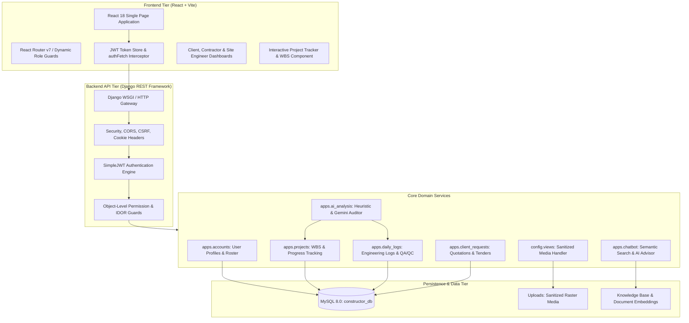
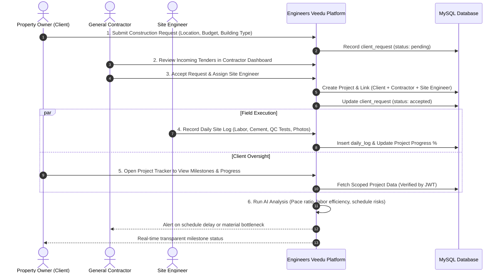
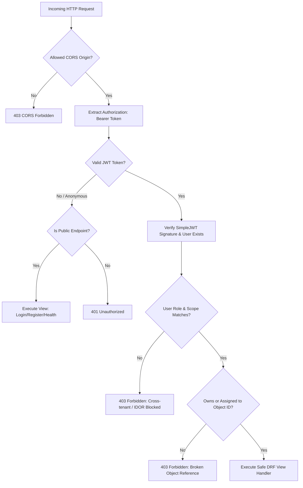

# Engineers Veedu — Comprehensive Project Report & Industry-Standard Architecture

## 1. Executive Summary

**Engineers Veedu** is an enterprise-grade civil engineering and construction management platform designed to bridge communication and operational gaps between **Property Owners / Clients**, **General Contractors / Builders**, and **Field Site Engineers**.

The platform streamlines:
- **Tender & Project Inception**: Clients submit architectural requirements and location details to vetted contractors.
- **Roster & Site Assignment**: Contractors manage team engineers and assign active sites.
- **Granular Daily Site Logs**: Site engineers submit chronological day-by-day logs detailing trade labor, material utilization, slump/cube tests, and photographic proof.
- **AI-Powered Schedule & Efficiency Auditing**: Automated heuristic and Gemini-powered progress variance, delay risk classification, and milestone predictions.
- **Context-Aware AI Assistant**: Semantic RAG chatbot answering building code, structural engineering, and estimation questions.

---

## 2. System Architecture

---

## 3. End-to-End Operational Flowcharts

### 3.1 Multi-Role User Journey & Project Lifecycle

---

### 3.2 Secure API Authentication & IDOR Authorization Pipeline

---

## 4. Standard Operating Procedures (SOP) — Industry Standard Usage

### Phase 1: Client Onboarding & Project Tender
1. **Account Registration**: The property owner creates an account selecting role `client`.
2. **Project Initiation**: From the Client Dashboard or Community Network, the client submits a construction tender specifying:
   - Target location (e.g., Chennai, Coimbatore).
   - Planned budget (e.g., ₹65,00,000).
   - Structural type (e.g., Residential Villa / Multi-Storey RCC).
   - Architectural scope & soil conditions.

### Phase 2: Contractor Mobilization & Team Assignment
1. **Tender Review**: The contractor receives the inquiry on their Contractor Dashboard.
2. **Technical Feasibility**: Contractor inspects parameters and either accepts or specifies a structured decline reason.
3. **Site Engineer Provisioning**:
   - The contractor adds qualified site engineers under their company roster (`POST /api/contractors/<id>/engineers`).
   - The contractor launches the project and designates the primary site engineer.

### Phase 3: Construction Execution & Daily Site QA/QC
1. **Daily Log Submissions**: Every workday at shift end, the site engineer submits a verified record via Quick Log or Project Tracker:
   - **Trade Breakdown**: Masons, carpenters, bar benders, helpers.
   - **Materials Consumed**: Bags of cement, steel tonnage, brick counts, concrete grade (e.g., M25).
   - **Quality Assurance**: Slump test values (mm), cube test curing days, shuttering alignment.
   - **Visual Proof**: Geo-tagged site photo uploaded through the sanitized image pipeline.
2. **Progress Auto-Compounding**: Each log automatically compounds the overall project completion percentage and updates stage transitions.

### Phase 4: Automated AI Health & Schedule Variance Auditing
1. **Pace Evaluation**: The engine computes `actual_pace (%/day)` vs `required_pace (%/day)` against the committed delivery date.
2. **Blocker Detection**: NLP heuristics extract unresolved delays (weather, material shortage, inspection holds).
3. **Gemini Insights**: Senior structural engineer recommendations are generated and delivered to both client and contractor.

---

## 5. Security & Governance Matrix

| Domain | Standard Implemented | Verification Method |
|---|---|---|
| **Authentication** | Stateless JWT (HS256) with 7-day access and 30-day refresh lifecycles | Automated login token check |
| **Authorization** | Strict object-level RBAC; client, contractor, and engineer query isolation | Attempted cross-tenant modification returned 403 |
| **Data Integrity** | MySQL 8.0 with `STRICT_TRANS_TABLES`, UTF8MB4 charset, and transactional ORM | Automated model migrations |
| **Media Security** | Strict raster format whitelisting (`.jpg`, `.jpeg`, `.png`, `.webp`), 10 MB size ceiling, canonical path traversal checks | Automated traversal test returned 404 |
| **Client Defense** | Zero hardcoded API secrets in React bundle, XSS auto-escaping JSX, no dangerous innerHTML | ESLint + Grep audit passed clean |
| **Network Security** | Explicit CORS origin whitelist, CSRF middleware active, clickjacking defense (`DENY`), Content-Type-Options (`nosniff`) | Django `check --deploy` verified |
